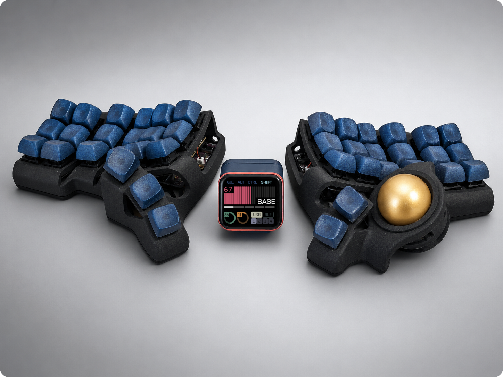
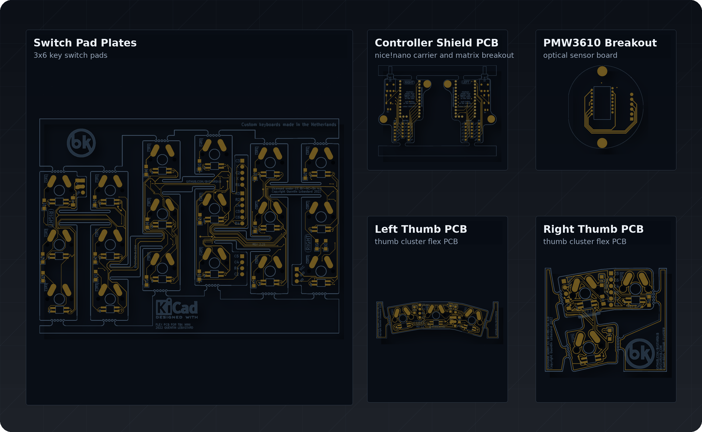
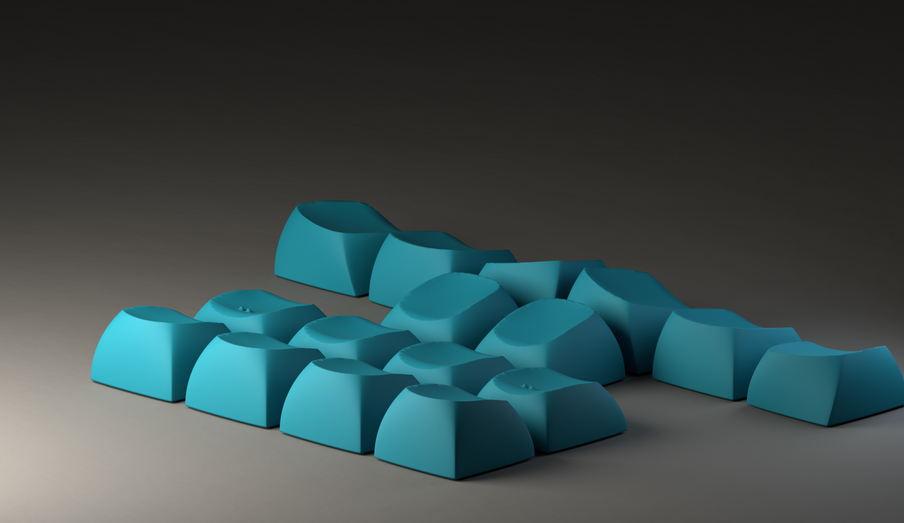
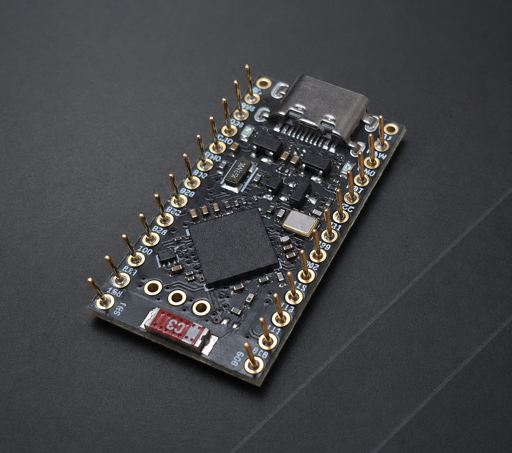
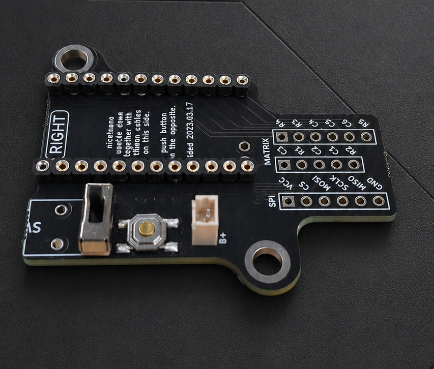
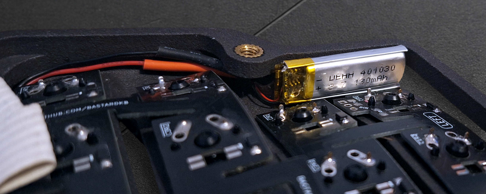
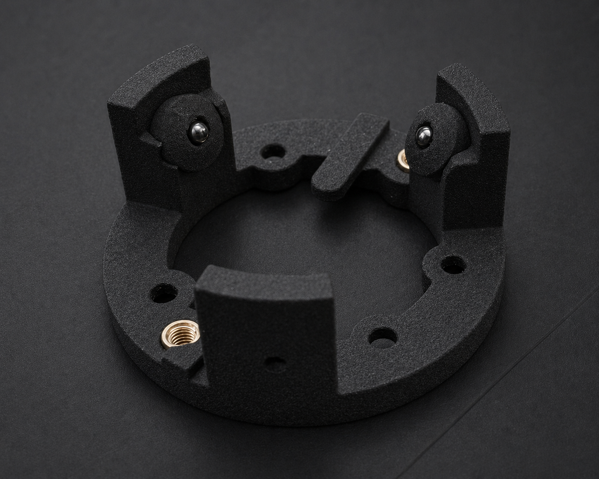
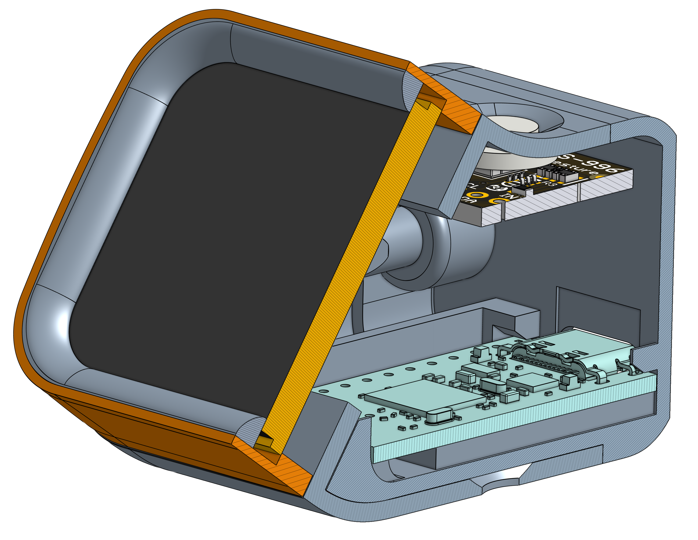

## Wireless Charybdis Mini (3x6) Build Guide | BLE, Dongle, Prospector, and Firmware

  

## Intro

This repository is a complete build guide for the wireless Charybdis Mini (3x6), a split ergonomic keyboard with a column-staggered keywell and integrated trackball. It covers the full wireless build process and pairs it with a purpose-built ZMK firmware repo designed for easy configuration and customization.

It also provides a simple build guide for the Prospector dongle (see the Prospector Assembly section for more details on what it is, what it does, and how to build it).

Huge thanks to Quentin and BastardKB for sharing this work with the community. If you prefer a kit or assembled keyboard, BastardKB sells both of those for the wired Charybdis, as well as a number of other keyboards and accessories at https://bastardkb.com/.

## Highlights

- Multiple build options, including BLE split, standard dongle, and Prospector display dongle paths
- Default firmware to get you started using your keyboard as soon as the build is complete
  - Includes multiple keymap options and guidance for adjusting the defaults or adding your own
  - Automatic keymap image generation so you can easily reference the function of each key across all layers
  - Trackball behavior, pointer speed, scrolling, and keymap settings are all tunable and optimized for easy adjustment.
  - Simple firmware build paths are available for local builds and GitHub Actions
- Prospector dongle features:
    - Support for XIAO and nice!nano controller boards
    - Support for touch and lower-cost non-touch screens
    - Custom printable housings for non-standard controller boards & screens
    - Support for enabling automatic display sleep
    - Support for three variations of the APDS9960 ambient light sensor
    - Support for all the upstream Prospector themes

**Disclaimer**

Building and modifying electronics carries real risk. Proceed carefully, and understand that this guide is a reference, not a guarantee. I'm not responsible for any damage or loss.

## Parts & Build Files

The tables below cover the parts used in this build. I would recommend ordering a few extras when it comes to the smaller components (e.g. capacitors and resistors) just in case something gets lost or broken during assembly.

All build files have been mirrored in this repo to ensure continuity with this guide, but the links below point directly to the original sources. If you find these useful, please drop a star on their repositories to support their hard work.

### PCBs

  

Use the Gerber files to order the PCBs.
I used [JLCPCB](https://jlcpcb.com/) and had good results.

| Part                                                                                                     | Quantity     |
| -------------------------------------------------------------------------------------------------------- | ------------ |
| [PMW3610 breakout PCB](https://github.com/victorlucachi/charybdis-pmw3610-breakout/tree/nicenano/production) | 1            |
| [nRF52840 Controller Board Shield PCB](https://github.com/olidacombe/Elite-C-holder/tree/nicenano/adapter/production)       | 2            |
| [Thumb Right (0.8mm thickness)](https://github.com/Bastardkb/Charybdis-PCB-thumbs/releases/tag/2.01)     | 1            |
| [Thumb Left (0.8mm thickness)](https://github.com/Bastardkb/TBK-Mini-PCB-thumb-cluster/releases/tag/2.1) | 1            |
| [Switch Pad Plates (0.8mm thickness)](https://github.com/Bastardkb/TBK-Mini-PCB-plate/releases/tag/2.21)     | 2            |

> [!WARNING]
> **A thickness of 0.8mm or less** must be used for the left thumb, right thumb, and plate PCBs.

### PMW3610 Breakout Components

These are all the components required for the PMW3610 breakout PCB.

Choose one of two assembly paths before ordering parts:

**Option 1:** Vendor (JLCPCB) Assembly

For a fee, JLCPCB will assemble and solder the components during PCB fabrication. Select this option at checkout and supply the bom.csv and positions.csv from the PMW3610 breakout zip.

> [!NOTE]
> The BOM uses [C146366](https://jlcpcb.com/jp/partdetail/TOSHIBA-TCR2EF19_LMCT/C146366) (TCR2EF19,LM(CT)) by default, which is frequently out of stock. [C79924](https://jlcpcb.com/partdetail/TexasInstruments-TLV70018DDCR/C79924) (TLV70018DDCR) is a confirmed substitute and is normally available. Swap it in if C146366 shows as out of stock.

**Option 2:** Self-Assembly

If you want to solder the components yourself, order the parts below.

| Part                                                                                        | JLCPCB Part #                                                                | MFR. Part #       | Quantity     |
| ------------------------------------------------------------------------------------------- | ---------------------------------------------------------------------------- | ----------------- | ------------ |
| [PMW3610 sensor module with lens (LM18-LSI)](https://www.aliexpress.us/item/3256806022278018.html) | N/A                                                                          | N/A               | 1            |
| [LDO](https://www.mouser.com/ProductDetail/595-TLV70018DDCR)                                | [C79924](https://jlcpcb.com/partdetail/TexasInstruments-TLV70018DDCR/C79924) | TLV70018DDCR      | 1            |
| [Thick Film Resistor](https://www.mouser.com/ProductDetail/303-0603WAF2004T5E)              | [C22976](https://jlcpcb.com/partdetail/23703-0603WAF2004T5E/C22976)          | 0603WAF2004T5E    | 1            |
| [Ceramic Capacitor](https://www.mouser.com/ProductDetail/187-CL10A105KB8NNNC)              | [C15849](https://jlcpcb.com/partdetail/16531-CL10A105KB8NNNC/C15849)         | CL10A105KB8NNNC   | 1            |
| [Ceramic Capacitor](https://www.mouser.com/ProductDetail/603-CC603KRX7R9BB104)             | [C14663](https://jlcpcb.com/partdetail/Yageo-CC0603KRX7R9BB104/C14663)       | CC0603KRX7R9BB104 | 1            |
| [Ceramic Capacitor](https://www.mouser.com/ProductDetail/187-CL10A475KO8NNNC)              | [C19666](https://jlcpcb.com/parts/componentSearch?searchTxt=C19666)          | CL10A475KO8NNNC   | 7            |

### 3D Print Files

Use the files in the `3d-print` directory to print the keyboard parts.
If you order these from JLC3DP, they may warn that some parts are too thin. I accepted the warning and the parts printed correctly.

| Part                                                                                                                                  | Quantity     |
| ------------------------------------------------------------------------------------------------------------------------------------- | ------------ |
| [Right Plate](https://github.com/Bastardkb/Charybdis/blob/3908164/files/3x6%20mini/plate_v1_v11.stl)                                  | 1            |
| [Left Plate](https://github.com/erenatas/charybdis-wireless-3x6/blob/master/3d-prints/plate_v3_v29_mirrorred.stl)                     | 1            |
| [Right Case](https://github.com/Bastardkb/Charybdis/blob/2dad0ca/files/3x6%20mini/CMini_v1_v11.3mf)                                   | 1            |
| [Left Case](https://github.com/erenatas/charybdis-wireless-3x6/blob/master/3d-prints/case_v3_v29_mirrorred.stl)                       | 1            |
| [Sensor Cover](https://github.com/Bastardkb/Charybdis/blob/9130a58/files/sensor_cover_v51.stl)                                        | 1            |
| [Trackball Housing Top](https://github.com/Bastardkb/Charybdis/blob/c818c76/files/3x5%20nano/adapter_v2_top_v75.stl)                            | 1            |
| [Trackball Housing Bottom](https://github.com/Bastardkb/Charybdis/blob/d0e20cc/files/mods/btu/adapter_btu_bottom_v32.stl)                   | 1            |
| [Ball Transfer Unit (BTU) Socket](https://github.com/Bastardkb/Charybdis/blob/322faad/files/mods/printable-btu/printable_btu_2.5mm_ball.stl) | 3            |

> [!NOTE]
> If you plan to use metal bottom plates for weight or magnetic tenting, don't print the plates above. Instead, use the DXF files in the `cutting` directory to have them cut, either in standard form or with MagSafe alignment rings.

### Controller Board & Electronics

While the [nice!nano v2.0](https://nicekeyboards.com/nice-nano/) is the standard controller board for wireless Charybdis builds, more budget-friendly options exist. For the most part, these are a drop-in replacement, but make sure you understand the tradeoffs before using one of them instead of the nice!nano.

This build uses the SuperMini nRF52840. You can find a full list of other compatible controller boards that use the same nRF52840 micro-controller (MCU) on the [nRF52840 Wiki](https://github.com/joric/nrfmicro/wiki/Alternatives).

| Part | Quantity |
| :--- | :--- |
| [nRF52840 controller boards](https://www.aliexpress.us/item/3256805848952479.html?gatewayAdapt=glo2usa) | 2 (3 for a dongle build) |
| [1N4148W Signal Diodes](https://www.amazon.com/gp/product/B079KJX5J9/ref=ox_sc_act_title_1?smid=A14FP9XIRL6C1F&psc=1) | 41 |
| [Button (4x4x1.5)](https://www.aliexpress.us/item/2255800859820067.html?gatewayAdapt=glo2usa4itemAdapt) | 2 |
| [Mini Toggle Switch SPDT 3mm](https://www.amazon.com/Position-Breadboard-Electronic-Miniature-SlideSwitch/dp/B09R42XQTB) | 2 |
| [Mill Max Low Profile Sockets (optional)](https://www.mouser.com/ProductDetail/Mill-Max/315-43-112-41-003000?qs=s8Nb1z4Wn%2FRfWrVqQ0TOuQ%3D%3D) | 4 |
| [Mill Max Pins (optional)](https://www.mouser.com/ProductDetail/Mill-Max/3320-0-00-15-00-00-03-0?qs=s8Nb1z4Wn%2FQ16WBIwCPrTw%3D%3D) | 48 |

> [!NOTE]
> The pin headers included with the controller board can be used in place of the more expensive socket headers, as long as they don't prevent the USB port from lining up with the case opening.

### Power

| Part | Quantity |
| :--- | :--- |
| [3.7V 130mAh 401030 Li-Po Batteries](https://www.aliexpress.us/item/3256805609268740.html?) | 2 |
| [JST plug 2-pin](https://www.aliexpress.com/item/2251832721663484.html) | 2 |
| [80MM FFC for controller board & thumb plates](https://www.aliexpress.us/item/3256803312420217.html) | 2 of each - 6 pin, 5 pin, 4 pin |
| [100MM FFC for PMW3610 breakout PCB](https://www.mouser.com/ProductDetail/TE-Connectivity/FSN-24A-15?qs=sGAEpiMZZMv0DJfhVcWlK2hMVXoZwMunw%2Fzfkr%2F5Lgc%3D) | 2 |

**Battery:** You can use a different battery capacity, but make sure the battery is 3.7V and fits your chosen mounting location. The [ZMK Power Profiler](https://zmk.dev/power-profiler) can help you estimate the mAh you need for your application.

**Wires:** The flat flexible cables (FFC) work well and make the wiring clean, but small-gauge wire also works. While testing, I used 24 gauge wire out of an old solid core Ethernet cable, along with some JST connectors.

### Fasteners & Hardware

| Part | Quantity |
| :--- | :--- |
| [Trackball (34mm)](https://www.amazon.com/Perixx-18021-PERIPRO-303GR-Trackball-Compatible/dp/B071NX7Y2J) | 1 |
| [2.5mm Silicon Nitride Ceramic Ball Bearings](https://www.aliexpress.us/item/2255799954006155.html) | 3 |
| [M3 x D5 x L5 Brass Heat-Set Inserts](https://www.aliexpress.us/item/3256805371193370.html) | 5 |
| [M4 x D6 x L5 Brass Heat-Set Inserts](https://www.aliexpress.us/item/2255800046610840.html) | 12 |
| [M3x8mm Screws](https://www.aliexpress.us/item/2251832820627860.html) | 5 |
| [M4x8mm Countersunk Screws](https://www.aliexpress.com/item/2251832820627860.html) | 12 |
| [Adhesive Bumper Pads](https://www.amazon.com/Shintop-Furniture-Bumpers-Protection-Hemispherical/dp/B01DU0O00W) | 1 |

### Keycaps & Switches

  

| Part | Quantity |
| :--- | :--- |
| [Gateron Oil King 2.0 Linear Switches](https://www.aliexpress.us/item/3256806388542736.html) | 41 |
| [r1](3d-print/des-key-caps/r1.stl)       | 2 JLC3DP orders   |
| [r2](3d-print/des-key-caps/r2.stl)       | 2 JLC3DP orders   |
| [r3](3d-print/des-key-caps/r3.stl)       | 2 JLC3DP orders   |
| [thumb](3d-print/des-key-caps/thumb.stl) | 1 JLC3DP orders   |

I have been using [pseudoku's DES profiled key caps](https://github.com/pseudoku/PseudoMakeMeKeyCapProfiles) in SLS nylon and resin cast for this build, and they have been phenomenal. That said, keycaps are personal preference, so these are optional if you already have caps you like. Same goes for the key switches. As long as they are MX style they should work.

> [!NOTE]
> Due to JLC3DP ordering requirements, each key row file is in groups of 10 keys. You can either order extras to get the 12 needed for each row, or use something like the [Z-Butt Artisan keycap creation platform](https://github.com/imyownyear/Z-Butt) from imyownyear to create molds of the first 10 you order, then use that to create an unlimited number of resin copies.

## Tool List

### Required:
- Soldering iron with a fine tip and adjustable temperatures
- Solder
- Fume filter fan
- Flush-cutting pliers
- Double sided tape (if you want to mount the battery the same way this build does)
- Screw driver
- Scissors

### Recommended:
- Kapton tape
- Heat shrink tubing for battery connection
- ESD mat and strap
- ESD safe tweezers
- Flux
- Solder wick

### Optional:
- Magnifying glass or cheap microscope to examine solder connections

## **Keyboard Assembly**

With all parts in hand, assembly can begin. Rather than duplicate existing work, these instructions reference the BastardKB documentation where applicable, as it is thorough and well-maintained.

### 1. Heat-Set Inserts

Follow BastardKB's build guide to [install screw inserts on both cases](https://docs.bastardkb.com/bg_cnano/04screw_inserts.html).

Then follow their guide to [install screw inserts on the trackball & sensor assembly](https://docs.bastardkb.com/bg_cnano/11sensor_assembly.html#top-housing---screw-inserts).

### 2. Diodes

Use [BastardKB's guide](https://docs.bastardkb.com/bg_cnano/05diodes.html) to solder diodes on both plates and thumb clusters.

### 3. Controller Board Shield PCB

Solder the power switches and reset buttons to the left and right controller board shield PCBs, then solder on the JST female connectors. Position the connector so the red wire on the male side aligns with the battery's positive connection. The legs may need to be bent out slightly to get each connector to sit flush with the board.

### 4. Controller Board

Solder the controller boards to the controller board shield PCB using either standard or socketed pin headers, depending on what you ordered.

The controller board should be mounted face down, with components facing toward the controller board shield PCB. The top two through holes on either side of the USB connector (redundant GND & Batt+) do not have corresponding pads on the controller board.

> [!WARNING]
> The nRF52840 controller boards and the PMW3610 sensor are heat-sensitive. Keep your soldering iron **between 270°C and 300°C** when working on these components. Going above 300°C risks permanent damage to the ICs. Going below 270°C risks cold solder joints, which produce weak and unreliable connections.

#### Socket Headers

If using socketed headers, be careful not to let solder wick down into the socket. If that happens, the pin may become fixed in the socket. The pins should only be soldered to the through-holes of the controller board. Use Kapton tape to block solder from entering the sockets while you solder the pins to the controller board:

   1. Place a piece of Kapton tape over the top of the socket holes
   2. Position the controller board so the through-holes align with the socket pins
   3. Poke each pin through the tape and controller board through-hole until it seats into the socket
   4. Solder each pin to the controller board through-holes

#### Soldering Test

The controller boards should look similar to this:

  

The shields should look like this:

  

Test the power connections before continuing. Connect the controller board to the shield. Avoid shorting any exposed connection while you plug in the JST battery connector, flip the switch on, and confirm the controller board powers on (an LED will light up). If all goes well, unplug the battery and continue assembly.

### 5. Wiring

Use BastardKB's documentation on [how to cut and solder the ribbon cables](https://docs.bastardkb.com/bg_cnano/07ribbon_cables.html#cutting-the-cables).

Then follow the BastardKB docs on [how to connect all of the PCBs together](https://docs.bastardkb.com/bg_cnano/09cables_to_splinky.html).

Use the flush-cutting pliers to remove any protruding wire, pins, and solder from the back side of the PCBs so that they can sit flat against the cases when the switches are being soldered in.

### 6. Battery

Using the double sided tape, mount the batteries on the inside lip of each case like this:

  

If you choose a different battery or mounting location, make sure it is secured and clear of sharp solder joints or components.

### 7. Switch Pad Electrical Test

Now that all the PCBs for the keys are connected, follow BastardKB's documentation to [test the switch pads and internal connections](https://docs.bastardkb.com/bg_cnano/10install_the_switches.html#testing-the-pcbs).

If no key triggers register, try flashing firmware that matches this build before troubleshooting the wiring further.

### 8. Switches

Once all the switch pads have been confirmed to work, solder in the switches by following [BastardKB's process](https://docs.bastardkb.com/bg_cnano/10install_the_switches.html#installing-the-switches).

### 9. PMW3610 Breakout Assembly

#### Component Soldering (optional)

If you've chosen to solder the components onto the PMW3610 breakout PCB, follow the diagram below to position them correctly.

  

#### Solder PMW3610 Sensor Module to Breakout PCB

Before soldering, remove the sensor lens or cover it with Kapton tape to protect it from heat and solder. Orient the sensor module into the correct position on the PCB, then solder it in place. Once soldering is complete, replace the lens if it was removed. The sensor will not function without it.

> [!WARNING]
> As mentioned above, keep the soldering iron between 270°C and 300°C

### 10. PMW3610 Breakout Installation

Install the BTUs into the bottom trackball housing, then insert the ball bearings. It should look similar to this:

  

Insert the trackball top housing into the right-side case, then screw the bottom housing into the top housing.

Temporarily mount the PMW3610 breakout PCB to help with wire routing and soldering.

Follow the BastardKB guide to [solder the PMW3610 breakout PCB to the controller board shield PCB](https://docs.bastardkb.com/bg_cnano/11sensor_assembly.html#soldering-the-sensor-pcb-to-the-splinky-shield).

> [!NOTE]
> Even though the linked guide uses a Splinky-based wired build and a slightly different PMW3610 breakout PCB, the installation process should match the parts we're using.

Remove the temporary screws, install the sensor cover, then fasten the breakout PCB again.

### 11. Finishing Steps

#### Pads

Install the anti-slip pads on to the bottom of each plate.

#### Keycaps

Install the keycaps.

### 12. Final Test

Connect the left half to the computer and confirm all the keys still work.

Do the same with the right half.

> [!NOTE]
> The trackball and dongles are generally not supported in the firmware that comes on the controller board. To test those components, flash firmware that supports your specific build. My firmware builds can be found in the firmware section below. There are many options provided by the community as well.

At this point, the keyboard assembly is complete.

If you are using a standard dongle, put it in whatever enclosure you’re using after flashing.

If you're also building a Prospector dongle, continue with the build steps below.

## Prospector Assembly (optional)

  

The Prospector is a ZMK display dongle, extended from [carrefinho's original design](https://github.com/carrefinho/prospector). Rather than connecting the keyboard directly to a host device, the Prospector acts as the central hub, giving you a color status screen that reflects active layer, battery charge, mod key state, and typing speed in real time.

This build extends the original Prospector in two areas:

**Firmware:** My firmware (linked below) adds support for nice!nano v2 and any nRF52840 board sharing the same form factor and pin layout. Display blanking and sleep options are also included, so the screen shuts off automatically when the keyboard isn't in use rather than leaving the backlight on indefinitely.

**Enclosures:** New printable enclosures bring support for nice!nano v2 form-factor boards, two additional APDS9960 ambient light sensor sizes, and a lower-cost non-touch display alternative.

---

### Choose a Prospector Variant

If you want the simplest lower-cost build, use a nice!nano-style controller, the non-touch display (SKU: 24382), and no ambient light sensor. If you want automatic brightness, add one of the APDS9960 sensor options. If you prefer the glass front panel, use the touch display (SKU: 27057). The touch and non-touch displays use the same display driver, so display choice does not affect which firmware build you flash.

> [!TIP]
> My preference is the no-sensor build, with keyboard controls used to adjust display brightness as needed. The APDS9960 works just fine, but unless the dongle is in direct, bright light, it can take tuning to make the automatic brightness curve reach full brightness. Skipping the sensor also means fewer wires from a very small enclosure, which makes final assembly noticeably easier.

Printable enclosure files for the supported combinations are in [`3d-print/prospector`](3d-print/prospector). The folder is split by part type: bodies, bezels, and controller rear caps. Choose files that match your controller board, display type, and ambient light sensor option.
The pre-made print files for the controller rear cap have fit the majority of my controller boards, but if yours needs a small fit adjustment, use the assembly configuration options in [OnShape](https://cad.onshape.com/documents/1ab8632c0729c14a80991694/w/0a5575e0aa91142d15642877/e/682a60f01e1bc7dffe519c9c) to tune the pocket dimensions for the controller board PCB and USB height. If you're familiar with OnShape, all of the models are freely available to import and customize in any way you'd like.

### Supported Variants - Bill of Materials

Work through each category below to determine which parts to print and purchase for your build.

#### Controller
| Option | Notes |
| :--- | :--- |
| Seeed Studio XIAO nRF52840 | Original Prospector target platform |
| nice!nano v2 or compatible NRF52840 board | Must share the same form factor and pin-out. Enclosure support added in this build |

#### Display
| Option | Notes |
| :--- | :--- |
| Waveshare 1.69" touch LCD (SKU: 27057) | Glass front panel |
| Waveshare 1.69" non-touch LCD (SKU: 24382) | Lower cost alternative |

> [!NOTE]
> The touch display's only practical advantage over the non-touch option is its glass front panel. If that doesn't matter to you, the non-touch option saves money with no functional tradeoff.

#### Ambient Light Sensor (optional)
| Option | Notes |
| :--- | :--- |
| APDS9960 | Enables automatic brightness adjustment. Multiple module sizes supported |
| None | Recommended for most builds. Use keyboard controls to adjust brightness when needed |

There are three supported versions of the APDS9960 sensor:

- [APDS9960 – Adafruit small](https://www.adafruit.com/product/3595)
- [APDS9960 – Adafruit standard](https://www.mouser.com/new/adafruit/adafruit-apds9960-dev-board/)
- [APDS9960 – Generic](https://www.amazon.com/HiLetgo-APDS-9960-Recognition-Direction-Proximity/dp/B01NACU412)

> [!IMPORTANT]
> The generic sensor is cheap and easy to find, but its dimensions require a slightly longer controller rear cap. Use one of the `long` versions if you intend to use that sensor.

#### Enclosure

All models except the original XIAO controller rear cap can be printed without supports.

| Part                                | Quantity |
| ----------------------------------  | -------- |
| Body                                | 1        |
| Controller rear cap                 | 1        |
| Display bezel                       | 1        |
| Display frame (only for non-touch)  | 1        |
| Transparent sensor cover (optional) | 1        |

> [!IMPORTANT]
> Make sure the enclosure parts match the controller board, display, and ambient light sensor you plan to use. Most parts are modeled for a specific hardware combination, so the wrong version may not align with the USB port, screen, sensor, or screw holes.

#### Fasteners & Electrical

| Screw Size | Description                                         | Quantity |
| ---------- | --------------------------------------------------- | -------- |
| M2 x 6     | Display to body assembly                            | 4        |
| M2.5 x 6   | Controller rear cap to body                         | 2        |
| M2.5 x 4   | Ambient light sensor (APDS9960 – Adafruit small)    | 2        |
| M2.5 x 4   | Ambient light sensor (APDS9960 – Adafruit standard) | 2        |
| M3 x 4     | Ambient light sensor (APDS9960 – Generic)           | 2        |

> [!NOTE]
> Screws install directly into printed holes and form their own threads in the plastic. 
> To avoid stripping the hole or cracking the part, tighten by hand until snug. 
> Use non-countersunk metric machine screws with a flat surface under the head. 

The displays include wire connectors that can be fastened or soldered to the controller board. The sensor board usually does not include wires, but any 28-32 AWG wire works just fine.

If you are using a generic APDS9960 sensor module, verify the solder jumpers before flashing.
- **PS jumper:** This jumper connects power to the APDS-9960 sensor and its IR LED. It is normally closed by default with a solder blob. When closed, the IR LED is powered from `VCC`, so the `VL` pin can be left unconnected.
- **I2C PU jumpers:** These jumpers connect the onboard 10 kΩ pull-up resistors for `SDA` and `SCL`. If the pull-up jumpers are closed, you do not need to add external I2C pull-up resistors.

For the driver to work correctly, the **two PS pads** and the **three I2C PU pads** should be solder-joined.

### Wiring

When using the XIAO controller board and the standard size light sensor, use the official [Prospector assembly manual](https://github.com/carrefinho/prospector/blob/main/docs/prospector_assembly_manual.jpg) as the baseline. For any other hardware combination, follow the instructions below:

  

Follow the pin-out diagram and tables to connect the electronics. You can solder everything together or you can use mechanical connections for easy removal & modification.

**Display - Both SKU: 24382 and SKU: 27057**

| Signal Name | Arduino Pin | nRF52840 GPIO | Function        | Prospector Wiring Note         |
| ----------- | ----------- | ------------- | --------------- | ------------------------------ |
| VCC         | VCC         | -             | 3.3V Power      | Direct to nice!nano VCC        |
| GND         | GND         | -             | Ground          | Direct to nice!nano GND        |
| LCD_DIN     | D4          | P0.22         | SPI MOSI        | Data from nice!nano to display |
| LCD_CLK     | D3          | P0.20         | SPI SCK         | Serial clock                   |
| LCD_CS      | D7          | P0.11         | SPI chip select | Active low                     |
| LCD_DC      | D5          | P0.24         | Data/command    | High=data, low=command         |
| LCD_RST     | D6          | P1.00         | Display reset   | Active low reset               |
| LCD_BL      | D1          | P0.06         | Backlight PWM   | PWM brightness control         |

**Display Touch**

Not currently used, but including in case touch features are added in the future.

|Signal Name|Arduino Pin|nRF52840 GPIO|Function|Prospector Wiring Note|
|---|---|---|---|---|
|TP_SDA|D20|P0.29|I2C SDA|Shared I2C data line|
|TP_SCL|D21|P0.31|I2C SCL|Shared I2C clock line|
|TP_RST|Free GPIO|Free GPIO|Touch reset|Must not conflict with display/APDS pins|
|TP_IRQ|Free GPIO|Free GPIO|Touch interrupt|Must not conflict with APDS INT|

**APDS9960 Ambient Light Sensor (optional, needed for auto-brightness):**

| APDS9960 Pin   | nice!nano Pin | nRF52840 GPIO | Function           | Notes                                  |
| -------------- | ------------- | ------------- | ------------------ | -------------------------------------- |
| INT            | D2            | P0.17         | Interrupt          | Active low with pull-up                |
| SCL            | D21           | P0.31         | I2C SCL            | Shared with touch SCL if touch is used |
| SDA            | D20           | P0.29         | I2C SDA            | Shared with touch SDA if touch is used |
| VCC / VIN      | VCC / 3V3     | -             | Power              | Use 3.3V                               |
| GND            | GND           | -             | Ground             | Common ground                          |
| VL / LED / 3Vo | -             | -             | Breakout-dependent | Usually unused by firmware             |

After all the parts are connected, plug in the controller board and make sure the controller board powers on and is ready for flashing.

### Assembly

**1. Firmware Installation**

Flash the appropriate Prospector firmware onto the controller board. Use the [firmware build family table](#zmk-firmware) below to match your hardware, then follow the firmware repo links there for the flashing workflow.

> [!NOTE]
> The firmware linked in this build has a button combo to put the dongle into bootloader mode. This is meant to make flashing the dongle much easier, especially when assembled. If you want a physical reset option you can connect the cap screws to the `GND` and `RESET` pins and short those from the outside, or just connect a wire to each pin and store them loose in the body then pull them through the bottom holes to short when needed.

**2. Display Wiring**

Connect or solder the screen wires to the controller board using the display pin-out table.

> [!WARNING]
> Do not solder anything, including pin headers to the two through holes next to the USB port (BATT & GND). It will prevent the controller board from sliding into place.

**3. Sensor Integration & Light Masking**

If using an ambient light sensor, connect or solder wires to the sensor, then connect or solder the other end of each wire to the controller board using the APDS9960 Ambient Light Sensor pin-out table.
Snap the sensor cover into place, then cover the controller board power LED with electrical tape so it does not interfere with the ambient light sensor or bleed through in low light conditions and cause distractions.
Screw the sensor into place.

If you are not using the sensor, skip this step entirely. This is the build path I recommend for most people because it leaves much more room for routing and seating the display wires.

**4. Power-On Verification**

Connect the screen JST connector to the screen, then plug in the controller and confirm the display powers on and shows the Prospector theme you chose.

**5. Screen Mounting**

Fit the screen through the body and bezel, then fasten it in place with the screws.

**6. Frame Fitting (Non-Touch Models)**

If using the non-touch screen, press the frame into place.

> [!NOTE]
> The frame is printed 2mm bigger than the ID of the bezel to create a tight friction fit. Make sure not to push it too tightly against the screen to avoid hot spots. If one shows up, just loosen the frame until it goes away.

**7. Seating the Controller**

Slide the controller board into the controller rear cap. If using the nice!nano version, there are shoulders by the USB port to lock the front in place. The rear of the controller board should be snug against the rear faces to prevent it from moving around.

> [!NOTE]
> If your nice!nano controller board doesn't fit quite right, adjust the dimensions in OnShape, and export a new printable file.

**8. Final Internal Assembly**

Slide the controller rear cap into the body. Go slow, and make sure wires don't get pinched. I've found it easiest to curl the wires to each side of the controller board and then let the sensor wires run down the middle.

**9. Functional Hardware Test**

Once the controller rear cap is seated flush with the body, test to make sure it powers on and shows the theme, and that the sensor works.

**10. Final Fastening & Pairing**

If that's gone well, screw the body to the controller rear cap and pair it with the keyboard halves.

## ZMK Firmware

  

Firmware for this build is maintained in the [charybdis-wireless-mini-zmk-firmware](https://github.com/280Zo/charybdis-wireless-mini-zmk-firmware) repo.

Use the table below to match your hardware to the firmware build family, then follow the firmware repo for flashing and customization.

| Build family | Use when |
| --- | --- |
| `bt` | You want the keyboard halves to connect directly to the computer over Bluetooth. |
| `dongle_standard_nano` | You are using a no-screen USB dongle. |
| `dongle_prospector_nano_no_sensor` | You built a nice!nano-style Prospector without an APDS9960 ambient light sensor. |
| `dongle_prospector_nano_sensor` | You built a nice!nano-style Prospector with an APDS9960 ambient light sensor. |
| `dongle_prospector_xiao_no_sensor` | You built a XIAO nRF52840 Prospector without an APDS9960 ambient light sensor. |
| `dongle_prospector_xiao_sensor` | You built a XIAO nRF52840 Prospector with an APDS9960 ambient light sensor. |

The firmware repo covers:

- [Ready-to-flash firmware releases](https://github.com/280Zo/charybdis-wireless-mini-zmk-firmware/releases)
- [Firmware flashing steps](https://github.com/280Zo/charybdis-wireless-mini-zmk-firmware#flash-the-firmware)
- [Keymap and feature overview](https://github.com/280Zo/charybdis-wireless-mini-zmk-firmware#overview--usage)
- [Customization instructions](https://github.com/280Zo/charybdis-wireless-mini-zmk-firmware#customization)
- [Local Docker build instructions](https://github.com/280Zo/charybdis-wireless-mini-zmk-firmware/blob/main/local-build/README.md)
- [GitHub Actions build workflow](https://github.com/280Zo/charybdis-wireless-mini-zmk-firmware#build-the-firmware)

After flashing a Prospector dongle build, power on the dongle first, then the left half, then the right half. This lets the battery widget assign each half in the expected order.

> [!NOTE]
> If this is the first flash, or if you are switching between Bluetooth and dongle builds, follow the firmware repo's reset-firmware guidance before flashing the normal builds.

## Credits
This guide builds on work from several people and projects:
- [BastardKB](http://bastardkb.com/) - Original Charybdis design and build docs
- [erenatas](https://github.com/erenatas/charybdis-wireless-3x6/blob/master/README.md) - Wireless build reference
- [pseudoku](https://github.com/pseudoku/PseudoMakeMeKeyCapProfiles) - DES keycap profiles
- [victorlucachi](https://github.com/victorlucachi) - PMW3610 breakout PCB
- [olidacombe](https://github.com/olidacombe) - nice!nano shield PCB
- [carrefinho](https://github.com/carrefinho/prospector) - Prospector dongle
